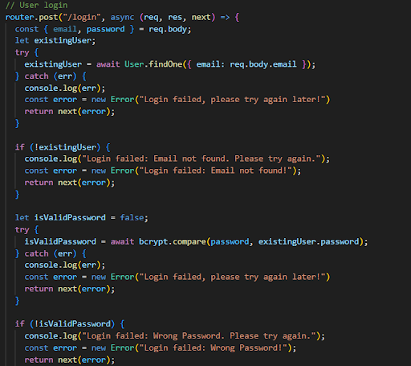
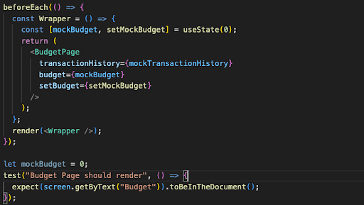
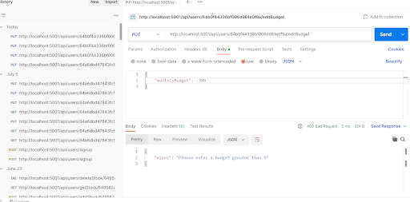

# Wealthwatch

A web application to help individuals monitor and keep track of their personal finances.
***
#### An Orbital Project by Ng weimin Alvin & Nicholas Tng Yong Kang
***
### Proposed Level of Achievement:
Apollo

### Motivation:
Have you ever run out of allowance or salary before the month ends? Ever ended the month with you overspending your intended budget? Fear not, our wealth watch is here to help you in financial planning and record expenses! 
We would like to improve our skills in software engineering by creating an application that can raise financial awareness at the same time. As full-time university students, we realised the importance of planning our finances to prevent ourselves from spending too much money before the month ends. It will help users to better control their spending habits and also track their progress towards a certain financial goal.

Use our app here: https://wealthwatch-client.vercel.app/

### User Stories:
|As a...|We hope to...|
|----|--------|
|Application developers|learn from this experience and share what problems we faced in the process of making the web application.|
|Application developer|help our users by providing convenience while also creating useful features that will help them on their financial tracking journey|
|User|be able to record and categorize our expenses into different categories.|
|User|be able to access our financial information in terms of visual representations such as charts or graphs to help us better visualize our spending patterns.|
|User|be able to receive useful and practical financial advice.|
|User|have my data stored so that I can access old data|
|User|create my own password so that my data can be secured|
|User|input my daily expenses to keep track of my overall expenditure|
|User|have a nice user interface to have a good experience using the app|
|Clumsy User|be able to delete transactions that I may have keyed in wrongly.|
|Investor|be able to view real time stock prices to understand how our current possessions are doing in the market.|

### Features:
1. Login and Signup feature (Completed)
2. Record and delete transactions made (Completed)
3. Breakdown spendings of different categories (e.g. Food, Transport, etc.) (Completed)
4. Visualize the user's financial information in terms of charts and graphs (Completed)
5. Provide financial advice to user (Completed)
6. Ability to track and access price of stocks from the webapp (Completed)
7. Ability to set budgets (Milestone 3)(Completed)
8. Alerts to provide useful notification to users (Completed)

### Tech Stack:
* MongoDB: used as database to store user credentials and other information
* NodeJS: enables running JavaScript code outside the browser
* ExpressJS: framework we use to build the backend of our application
* ReactJS: framework we use to create the frontend of our web application
* GitHub/GitHub Desktop: used for source control
* Postman: used in development and testing of backend server, sending requests to the server and receiving back response
* Vercel: used for the deployment of frontend of our web application
* Heroku: used for the deployment of backend of our web application

## Software Engineering Practices and Patterns:
### ER Diagram
We have identified 2 tables in our database, users and transactions. Users are related to transactions as the creator and transaction is **created by** a user; each transaction 
created belongs to **only one** user while each user is able to **create** **zero, one or many** transaction objects.

This ER diagram helps to represent the relationships between different entities and it provides a simpler view of complex entities.

### Activity Diagram

For our log in procedure, we designed a UML diagram to run through the sequence of events. Initially, the user is directed to a home page with a summary of the different functions our website provides. If the user is logged in, he or she will have access to the various services through the Navigation bar. Otherwise, the user’s navigation bar will prompt the user to log in, along with a button to route the user to the home page. By clicking on the log in, the user is redirected to the login page. 

If the user has an account, the user can log in, in which the back end will check whether a matching account is present in the database and act accordingly. Otherwise, the user will have an option to sign up for an account then log in. All in all, the user will have to log in to begin accessing the various services.

## DESIGN PRINCIPLES
### Reduce coupling
In our code,  we try to decrease the degree of dependence between components, classes, and methods by having different pages and keeping the components used in each page within their respective folders.

Following the principles of Object Oriented programming, we utilized different pages to split the respective components to reduce interactions between different pages.

### Make the Happy Path Prominent

Above are part of our code for the user signup and login routes from the backend, making the happy path prominent helps us to picture the ideal or expected flow of execution, where everything goes as planned without any errors or exceptions.It also simplifies the design and implementation of the software making it easier to understand, maintain and debug the system.

### Version Control with Git: Branches and Pull requests

We made use of different branches for the implementation of different features or the fixing of each bug. It enables us to develop simultaneously without affecting the main codebase and we are also able to work on separate branches at the same time. The use of pull requests also enhances our collaboration and communication with each other as we review each other's code, ensuring that no issues arise before merging the code with the main branch.

### Github Issues

For our project, we made use of Github Issues to plan out the various functions we wanted to implement in our project. We mainly utilized the labels low, medium and high priority to distinguish which features were more urgent by which milestone. 

Furthermore, we further broke down our issues into tasks to be completed. By doing so, we were able to stay informed of what was left to be done and hence plan our time well to complete our tasks by the given deadlines.

## FEATURES
### 1. Adding and deleting of expenses

We would like users to be able to record their transaction of their expenses into different categories.
Transaction Input: Users can manually enter the details of each expense they incur. This includes the expense amount, category (such as food, transportation, entertainment, etc.), and any additional notes or descriptions related to the expense.
Our app offers predefined expense categories to choose from, or it may allow users to choose the “Other” category based on their specific needs and specify under “Description”. Categorizing expenses helps users analyze their spending patterns and identify areas where they can potentially work on and reduce costs.
Transaction History: The transaction history keeps track of all the expenses recorded into the database. Users will be able to search up the description of the transaction which will filter out the transactions based on the input. They can also choose to delete the transaction if they entered any information wrongly or if they changed their mind in recording the transaction. Each transaction will also be color coded on the left based on its category for easy identification.

### 2. Breakdown spendings of different categories

After the user adds his transactions, our app accumulates the total amount the user spends in each category to allow users to have a better understanding on how much they spend on the respective categories.
### 3. Visualize the user's financial information in terms of charts and graphs

Graphs and charts are effective visual tools because they present information quickly and easily. It is not surprising then, that graphs are commonly used by print and electronic media. Sometimes, data can be better understood when presented by a graph than by a table because the graph can reveal a trend or comparison. Hence, our application decided to leverage on the ease of processing of data to provide our users with a better user experience by presenting our users’ spending habits in a donut graph.
 The chart displays the distribution of expenses across different categories, with each category having its own color code, for the convenience of differentiating the categories at one look. It also displays the total amount used for expenses in the middle.

### 4. Provide financial advice to user

With a click of a button, our app dispenses a money saving tip from our list of tips stored within the app. With this function, our users will be able to learn more tricks on how to save money without having the hustle to search for it online.
Designed to mimic a slot machine, our tip generator produces a rolling effect to present our tips in a fun and enjoyable manner for our users in a bid to increase the users’ experience when using the app.

### 5. Track and access real-time prices of stocks

With a click of a button, our app dispenses a money saving tip from our list of tips stored within the app. With this function, our users will be able to learn more tricks on how to save money without having the hustle to search for it online.
Designed to mimic a slot machine, our tip generator produces a rolling effect to present our tips in a fun and enjoyable manner for our users in a bid to increase the users’ experience when using the app.

Users can also analyze the price charts of the stocks. Simply click onto the box of the stock and they will be redirected to the price chart. This chart shows prices of 3 time periods, 1 day, 1 week and 1 year. Furthermore, users can zoom into specific parts of the graph by clicking over the area.

### 6. Ability to set budgets
Drawing inspiration from other applications, we aim to create a budget function to remind users to watch their spending.

Budgets are another important display to remind us to stick to our spending goals. Having a budget displayed will allow the user to know how much money they have to spend before they exceed their budget goals. We hope that by including a budgeting section, users will be more mindful of their spending.

Our budget feature allows our user to edit their monthly budget, once the user has entered in his desired budget, a progress bar will show the budget amount, the total amount our user has spent in the month and how far he is from exceeding the budget. Any attempts to enter any invalid values such as negative numbers will be handled as errors.

### 7. Changes to our Alerts

Budgets are another important display to remind us to stick to our spending goals. Having a budget displayed will allow the user to know how much money they have to spend before they exceed their budget goals. We hope that by including a budgeting section, users will be more mindful of their spending.

Our budget feature allows our user to edit their monthly budget, once the user has entered in his desired budget, a progress bar will show the budget amount, the total amount our user has spent in the month and how far he is from exceeding the budget. Any attempts to enter any invalid values such as negative numbers will be handled as errors.

## TESTING

### User Testing:
|Bugs Found|Fix to the bugs|
|----|--------|
|Website backend crashed after receiving an error|Created the error handling middleware in the backend to properly catch the error|
|Transaction history did not re-render after adding transaction to the backend|Fixed the bug by adding a reload function to it|
|Receiving an error when too many stocks added to the shortlist|Fixed it by fixing a quota to the number of stocks one can shortlist|
|Transaction history caused page to be endless when too many transactions were added|Sorted items in a scroll bar so total height was limited|
|Navigation bar did not update when the user logged out, allowing the user to access services despite being logged out|Used use-state and use-effect to update whenever the user logs out so that services could not be accessed|

To carry out user testing for our application, we engaged our friends and seniors in Computer Science to use our application which we hosted online and give us their thoughts on our website as a whole. In our survey, we asked our users to rate our application on a scale of one to ten. We also included questions such as how can our app be improved, with one question specifically asking about the User interface and user experience while another question asking more about the features. 

Our reason behind those questions was that we wanted to keep our questions as open as possible so that our users would be able to give any open and constructive feedback which we could use to better our project. We asked questions regarding our strengths and weaknesses so that we could have a better understanding on how we could improve and what we were doing well from an unbiased source. 

From our survey, we were able to gain more insights on specific features we can implement to further improve on our app. Furthermore, we were notified of certain bugs in the user interface in which we corrected immediately, such as a typo in our home page. Overall, we were able to gain deep insights on how we can further improve our application and that this form of testing was beneficial for our creation of this application.

### Unit Testing:

For milestone 2, we also conducted unit testing on several pages of our application, including the login page and the transaction input page. Our main focus was to ensure the functionality of input boxes and buttons and to identify any potential glitches.
	
To achieve this, we utilized the React Testing Library and implemented a range of functions to test the user input capabilities for login credentials such as username, email, and password. By performing these tests, we aimed to guarantee the smooth functioning of these essential features within our application.

Additionally, as part of our unit testing in milestone 2, we examined the text input and dropdown list input boxes in our transaction input page. Our objective was to ensure that these components were functioning correctly and in accordance with our expectations.

Through our various tests, we were able to identify various bugs within our program and edited our code accordingly to prevent possible glitches from occurring. Additionally, we employed our friends to test our code with various outputs and was able to gain insightful feedback from them. Consequently, we changed our design for certain components and controlled certain inputs so as to improve the users’ experience when using our application.

### Integration Testing:

For our integration testing, we tested our budgeting page. It was made up of various components such as the budget input, the buttons to submit the budget input and the progress bar. From our code above, we first checked that the page rendered and that the buttons and inputs were working in tandem. Consequently, we checked that the text “700” appeared, as that number was part of the progress bar component and by checking that, we could confirm that the progress bar did render as a result of the submission of the budget input, and that our components were working together fine.

Since we installed a package to render the progress bar, we initially encountered problems such as the progress bar not rendering as it should. Furthermore, we faced an issue whereby submitting our budget input did not immediately render the progres bar. Instead, we had to refresh the page just to render the bar. To solve this issue, we utilized the react “usestate” method to allow the change in our values to immediately cause a rerender on the progress bar. 

### System Testing:

For system testing, we created a test case whereby two users registered for an account with the same email. To do so, we made use of react testing package to key in the username input, email input and password input to be exactly the same. Consequently, our program worked exactly as it should as the first account was able to be created as planned, and the second email encountered an error whereby the page would display “ email taken “ and request the user create an account with a separate email. We also tested other cases where username and password were different and only email was the same, and the error was returned yet again.

Similarly, we tested the case where an invalid email was input, such as john instead of john@live.com, and an error was shown yet again as planned.

### Backend Testing:

To test our backend code, we used Postman to simulate the sending of requests to test whether our API endpoints return the intended responses. For example, to check that we have successfully edited the monthly budget property of the user in the budget page, we return the property after that and it is exactly what we entered in the PUT request. 

We can also see that by entering an invalid or inappropriate value, our backend code also handles the error by returning the error message. For example, asking our user to enter a value greater than 0 if they entered a value smaller than 0.

## Problems Encountered: 
1. During milestone 2, we made use of an API to retrieve stock prices. We also wanted our backend to store every users’ shortlist of stocks so that users need not constantly shortlist their stocks whenever they log into the app. Consequently, we needed to decide when our application would retrieve the relevant data from the backend and send it to the frontend.
 Retrieve too early and our application might run into efficiency problems, where our application retrieves the data and sends it to the API when the user does not actually want to look at stock prices.
Too late and our application might cause delays when users actually click onto the page, worsening the user’s experience.
Furthermore, the inclusion of an API in our retrieval process led to initial errors within the middleware as our API would refuse requests when too many stock prices were requested at once. All in all, we had to settle for a middleground where both efficiency and user experience is maximized by setting limits on the number of stocks a user can shortlist, while also deciding when the stock data be retrieved.

2. Our application also created a responsive transaction page. When a transaction input is entered into the system, we envisioned the transaction history component and the donut graph to update to show the up to date information. However, we noticed a bug where despite the backend receiving the latest data in which the input is entered into the array, our components were not rendering and hence displayed older information. Despite utilising use states and use effects to re-render the page, we still encountered this difficulty. In the end, we decided the best way to settle the page was to refresh the page so that all the data would be updated.

### Timeline:
|DATE|FEATURES|
|----|--------|
|14th May - 19th May|Prototype for application and layout of different pages|
|20th May - 25th May|Login and Sign Up feature for user|
|1st June - 5th June|Recording and deleting transaction feature|
|6th June - 10th June|Designing of doughnut chart feature and display of transaction history|
|11th June - 12th June|Creating tip generator|
|13th June - 20th June|Designing of stocks page|
|29th June - 2th July|Changing of alerts to enhance UI/UX|
|6th July - 12th July|Designing of the budget page and feature|
|15th July - 24th July|Unit, system and integration testing on various components|

